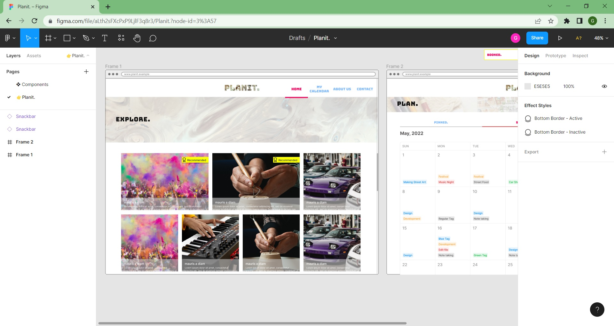

## About Planit

Planit allows people to find events with the accessibility to book and manage events to their own planner. Additionally it allows people to create new events.
[The following personal project is a demonstration of my existing experience of applying Full Stack Web Development along with applying new learning of tools, frameworks and libaries such as Git, Figma, Sass and Laravel.]

## Learning Figma

Figma has found to be a useful design tool before writing any code as this allows me (and for anyone else) to visualise the frontend through wireframing and also to plan the users journey.

## Planit: The Users Journey

- The User or Guest browses events

Events explored on the homepage appear in two sections but each are filtered differently: by recently added or by event opening times for tomorrow. Each filtered events section is a Laravel Component named 'Events' that takes an object property and loop outputs the Event.
- The User or Guest views an event
- The User can access the event calendar, alongside this is the users planner (Guest redirect to Login)

Both the calendar and planner stem from the same Laravel component named 'Calendar' however they each appear in a different format, calendar or a schedule, provided props decide the format through defined named css classes.
- The User can book an event for a given day and time

A User selects a day on the Event calendar which results in triggering a JavaScript event to build a CSRF protected form consisting of a dropdown of  hourly opening time slots, the user may proceed to confirm/book the event or click another day which removes the form from DOM.

- The User is then redirected to review their bookings

The User can view and cancel existing bookings seamlessly due to the cancellation form appears simply as a button in a modal where once clicked submits through an AJAX request. 

## Creating an Event

This partial demonstration of creating an event displays JavaScript form elements built from scratch

## Responsive Design

Example of mobile responsive design:
- Exploring Events
- Reviewing Planner

## Final Thoughts

I've acheived completion of developing an Event booking system which appears similar to my Figma design. I do however acknowledge there is room for additional content in every aspect of the journey, having informally followed the MoSCoW method principles to allow prioritisation of development tasks there are further additions I'd like to make if assigning it more time, but not limited to: 1. Include Unsplash Image API to search and store images based on category tags for creating Events, and 2. Include Mapbox API for pinning Event location.

I hope you've enjoyed this project demonstration and I look forward to any questions or feedback.

Greg Wheat

## About Laravel

Laravel is a web application framework with expressive, elegant syntax. We believe development must be an enjoyable and creative experience to be truly fulfilling. Laravel takes the pain out of development by easing common tasks used in many web projects, such as:

- [Simple, fast routing engine](https://laravel.com/docs/routing).
- [Powerful dependency injection container](https://laravel.com/docs/container).
- Multiple back-ends for [session](https://laravel.com/docs/session) and [cache](https://laravel.com/docs/cache) storage.
- Expressive, intuitive [database ORM](https://laravel.com/docs/eloquent).
- Database agnostic [schema migrations](https://laravel.com/docs/migrations).
- [Robust background job processing](https://laravel.com/docs/queues).
- [Real-time event broadcasting](https://laravel.com/docs/broadcasting).

Laravel is accessible, powerful, and provides tools required for large, robust applications.

## Learning Laravel

Laravel has the most extensive and thorough [documentation](https://laravel.com/docs) and video tutorial library of all modern web application frameworks, making it a breeze to get started with the framework.

If you don't feel like reading, [Laracasts](https://laracasts.com) can help. Laracasts contains over 2000 video tutorials on a range of topics including Laravel, modern PHP, unit testing, and JavaScript. Boost your skills by digging into our comprehensive video library.

## Laravel Sponsors

We would like to extend our thanks to the following sponsors for funding Laravel development. If you are interested in becoming a sponsor, please visit the Laravel [Patreon page](https://patreon.com/taylorotwell).

### Premium Partners

- **[Vehikl](https://vehikl.com/)**
- **[Tighten Co.](https://tighten.co)**
- **[Kirschbaum Development Group](https://kirschbaumdevelopment.com)**
- **[64 Robots](https://64robots.com)**
- **[Cubet Techno Labs](https://cubettech.com)**
- **[Cyber-Duck](https://cyber-duck.co.uk)**
- **[Many](https://www.many.co.uk)**
- **[Webdock, Fast VPS Hosting](https://www.webdock.io/en)**
- **[DevSquad](https://devsquad.com)**
- **[Curotec](https://www.curotec.com/services/technologies/laravel/)**
- **[OP.GG](https://op.gg)**
- **[WebReinvent](https://webreinvent.com/?utm_source=laravel&utm_medium=github&utm_campaign=patreon-sponsors)**
- **[Lendio](https://lendio.com)**

## Contributing

Thank you for considering contributing to the Laravel framework! The contribution guide can be found in the [Laravel documentation](https://laravel.com/docs/contributions).

## Code of Conduct

In order to ensure that the Laravel community is welcoming to all, please review and abide by the [Code of Conduct](https://laravel.com/docs/contributions#code-of-conduct).

## Security Vulnerabilities

If you discover a security vulnerability within Laravel, please send an e-mail to Taylor Otwell via [taylor@laravel.com](mailto:taylor@laravel.com). All security vulnerabilities will be promptly addressed.

## License

The Laravel framework is open-sourced software licensed under the [MIT license](https://opensource.org/licenses/MIT).
